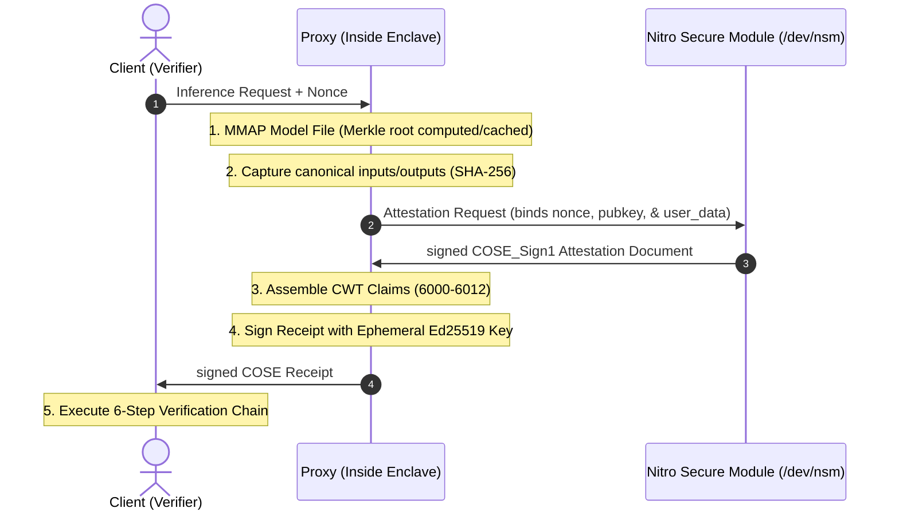

# VeriAI SDK 🛡️

VeriAI is a lightweight, vendor-agnostic attestation SDK for verifiable AI inference. It generates cryptographically signed receipts that bind model identity, input/output parameters, and secure hardware attestation (AWS Nitro Enclaves) to prove exactly what model was run, with what parameters, on what TEE hardware.

> [!IMPORTANT]
> **Security Model Warning (Library vs. Proxy Mode)**
> VeriAI operates in two distinct deployment configurations:
> - **Library Mode (Low-friction default)**: The SDK is imported by the host application to generate attestation documents and hash I/O. **Warning**: This mode *does not* prevent a dishonest operator from passing fabricated input/output bytes to the SDK while executing a completely different model.
> - **Proxy Mode (Secure)**: The VeriAI SDK runs as an intercepting proxy inside the secure AWS Nitro Enclave, directly managing inference I/O. Because the proxy binary is baked into the enclave's `PCR0`, clients can verify that the proxy itself is handling the data, shutting down operator-fabrication attacks. **Full protection is only achieved in Proxy Mode.**

---

## Architecture Flow



---

## Quick Start (Zero-Budget Simulation)

You can run a full end-to-end enclave simulation directly on your local machine (macOS/Linux) without spending a dime on AWS credits:

```bash
# Clone the repository
git clone https://github.com/sssec81/veriai-sdk.git
cd veriai-sdk

# Execute the local mock hardware demo
chmod +x demo.sh
./demo.sh
```

This runs a full pipeline simulation using the `--features mock-hardware` flag:
1. Compiles the CLI tool.
2. Creates dummy model, input, and output files.
3. Generates a signed COSE receipt (simulating AWS Nitro hypervisor certificate chain signatures).
4. Verifies the receipt against a mock CA root.
5. Simulates tampering and asserts that the verifier correctly rejects the tampered request.

---

## Build Configurations & Feature Flags

VeriAI uses compile-time guards to prevent accidentally deploying mock hardware simulations to live environments:

- `mock-hardware` (Default for dev/local testing): Uses simulated NSM API and signs certificates using a test PKI. **Compile-time blocked in release builds.**
- `real-hardware`: Configures the SDK to open `/dev/nsm` using the official `aws-nitro-enclaves-nsm-api` driver.
- `test-mode`: Bypasses the release-mode compile guard (only for testing release binaries in CI/CD).

### Compiling for Production
To build the production-ready SDK library for deployment inside an AWS Nitro Enclave:
```bash
cargo build --release --no-default-features --features real-hardware
```

---

## The 6-Step Verification Chain

VeriAI enforces a strict cryptographic verification chain:

1. **Signature Verification**: Validates the outer receipt signature using the enclave's ephemeral `enclave-pubkey` (Claim 6012).
2. **Attestation Validation**: Decodes the Nitro attestation report, validates its signature against the certificate chain up to the Root CA, and enforces a strict ±5 minute clock-skew tolerance.
3. **PCR0 Validation**: Verifies the enclave's PCR0 measurement matches the `expected_pcr0`.
4. **Pubkey Binding**: Confirms the public key inside the attestation report matches `enclave-pubkey` (6012).
5. **REPORTDATA Binding**: Checks that the attestation's user data matches the key binding signature:
   $$\text{REPORTDATA} = \text{SHA-512}(0\text{x}01 \mathbin{\Vert} \text{"VeriAI-KeyBind-v1"} \mathbin{\Vert} \text{Ed25519\_PubKey\_32bytes})$$
6. **Payload Checks**: Validates nonces, matches model/input/output hashes, and strictly monitors monotonic sequence numbers using identity fingerprinting.

---

## CWT Claims Registry

Custom CBOR Web Token (CWT) claims used in VeriAI receipts:

| Key | CDDL Type | Name | Description |
|---|---|---|---|
| **6000** | `bstr` | `model-hash` | SHA-256 Merkle root of the model weights |
| **6001** | `bstr` | `input-hash` | SHA-256 hash of the inference inputs |
| **6002** | `bstr` | `output-hash` | SHA-256 hash of the inference outputs |
| **6003** | `bstr` | `client-nonce` | Client-provided nonce (replayed in Nitro doc) |
| **6004** | `uint` | `sequence-num` | Monotonic sequence number (resets on reboot) |
| **6005** | `bstr` | `attestation-report` | Raw CBOR COSE_Sign1 attestation report |
| **6006** | `uint` | `attestation-type` | Attestation format (3 = AWS Nitro Enclaves) |
| **6007** | `int` | `attestation-timestamp` | Unix epoch time in seconds (±5 min tolerance) |
| **6011** | `text` | `sdk-version` | SDK version descriptor (e.g., `"veriai-sdk/1.0.0"`) |
| **6012** | `bstr` | `enclave-pubkey` | Enclave ephemeral Ed25519 public key |

*Claims 6008–6010 are reserved and must not appear in receipts.*

---

## License

This project is licensed under the Apache License 2.0. See the LICENSE file for details.
