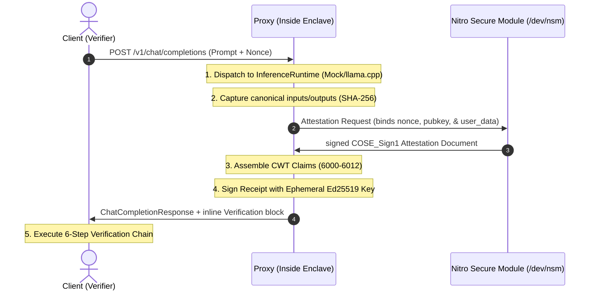

# VeriAI Platform 🛡️

[](https://www.rust-lang.org/)
[](LICENSE)
[](https://github.com/sssec81/veriai-sdk/actions)
[](security_review.md)

VeriAI is a Confidential AI Verification Platform and modular workspace. It generates and validates cryptographically signed receipts that bind model identity, input/output parameters, and secure hardware attestation (AWS Nitro Enclaves) to prove exactly what model was run, with what parameters, on what TEE hardware.

> [!IMPORTANT]
> **Deployment Configurations (Library vs. Proxy Mode)**
> VeriAI operates in two distinct deployment configurations:
> - **Library Mode (Low-friction default)**: The SDK is imported by the host application to generate attestation documents and hash I/O. **Warning**: This mode *does not* prevent a dishonest operator from passing fabricated input/output bytes to the SDK while executing a completely different model. Additionally, the model hash cache trusts local filesystem metadata (file size and modification time) rather than verifying content hashes dynamically. A local attacker with filesystem control could touch file metadata and swap model files without cache invalidation.
> - **Proxy Mode (Secure)**: The VeriAI proxy runs as an intercepting proxy inside the secure AWS Nitro Enclave, directly managing inference I/O. Because the proxy binary is baked into the enclave's `PCR0`, clients can verify that the proxy itself is handling the data, shutting down operator-fabrication attacks. **Full protection is only achieved in Proxy Mode.**

---

## Workspace Structure

The project is organized into a modular Cargo workspace isolating concerns:

```
crates/
├── veriai-types       # Shared CWT schemas, error definitions, and OpenAI API structures
├── veriai-core        # Merkle Tree hashing, receipt building, and verification engines
├── veriai-attestation # Hardware Attestation provider trait and mock/real driver backends
├── veriai-runtime     # InferenceRuntime traits and modular LLM adapters (mock/llama.cpp)
├── veriai-cli         # "veriai" CLI binary implementing inspect/verify checkmarks
└── verifier-service   # Axum REST service exposing JSON checklist verify endpoints

examples/
└── 01-chat-demo       # OpenAI-compatible completions server exporting verified receipts inline
```

---

## Architecture Flow



---

## Quick Start (Zero-Budget Simulation)

You can run a full E2E local enclave and completions server simulation directly on your local machine:

### 1. Run local E2E simulation script
```bash
# Execute local mock hardware pipeline
chmod +x demo.sh
./demo.sh
```

### 2. Start the OpenAI Chat Completions Server
```bash
# Launch completions endpoint
cargo run -p chat-demo
```
Send a chat request matching standard OpenAI completions signatures:
```bash
curl -X POST http://localhost:3000/v1/chat/completions \
  -H "Content-Type: application/json" \
  -d '{
    "model": "veriai-llama",
    "messages": [{"role": "user", "content": "hello veriai"}]
  }'
```
Response contains the completion output alongside the inline VeriAI cryptographic verification proof:
```json
{
  "id": "chatcmpl-veriai-001",
  "object": "chat.completion",
  "created": 1783963570,
  "model": "veriai-llama",
  "choices": [
    {
      "index": 0,
      "message": {
        "role": "assistant",
        "content": "VeriAI response: hello veriai"
      },
      "finish_reason": "stop"
    }
  ],
  "usage": {
    "prompt_tokens": 3,
    "completion_tokens": 15,
    "total_tokens": 18
  },
  "verification": {
    "valid": true,
    "receipt": {
      "version": "1",
      "model_hash": "5555555555555555555555555555555555555555555555555555555555555555",
      "input_hash": "52f82162237072eb234399e6b47c9927b2439927b2439927b2439927b2439927",
      "output_hash": "cc03ff251a48f3dc541567f9b91231dc53b6826ae1e892617067ada86d543137",
      "sequence_num": 0,
      "timestamp": 1783963570
    },
    "checks": [
      { "name": "Receipt Format", "status": "passed", "details": null },
      { "name": "Claims Parsing", "status": "passed", "details": null },
      { "name": "Receipt Signature", "status": "passed", "details": null },
      { "name": "Attestation Signature & Chain", "status": "passed", "details": null },
      { "name": "PCR0 Check", "status": "passed", "details": null },
      { "name": "REPORTDATA Binding", "status": "passed", "details": null }
    ],
    "attestation_provider": "nitro",
    "verified_hardware": true,
    "error": null
  }
}
```

---

## Build Configurations & Feature Flags

VeriAI uses compile-time guards to prevent accidentally deploying mock hardware simulations to live environments:

- `mock-hardware` (Default for dev/local testing): Uses simulated NSM API and signs certificates using a test PKI. **Compile-time blocked in release builds.**
- `real-hardware`: Configures the SDK to open `/dev/nsm` using the official `aws-nitro-enclaves-nsm-api` driver.

### Compiling for Production
To build the production-ready SDK library for deployment inside an AWS Nitro Enclaves:
```bash
cargo build --release --no-default-features --features real-hardware
```

---

## Operations & Hardening Configuration

The verifier supports strict panic-free validation constraints configured via `VerifierConfig`:

```rust
pub struct VerifierConfig {
    pub max_receipt_size: usize, // Default: 64 KB (rejects oversized CBOR buffers before parsing)
    pub max_clock_skew: i64,      // Default: 300s (rejects attestation time skews)
    pub max_receipt_age: i64,     // Default: 300s (rejects old/expired receipt replays)
}
```

The verifier service reads trust configuration at startup rather than accepting it
from clients. Set `TRUSTED_ROOT_CERT_PATH` (or `TRUSTED_ROOT_CERT_PEM`) and
`EXPECTED_PCR0` (96 hex characters). Set `STATEFUL_VERIFICATION=true` to keep
sequence state for the lifetime of the service process.

---

## Threat Model & Security Review

A comprehensive security review of the platform is maintained in [security_review.md](security_review.md). This covers mitigation trackers for:
- CBOR/COSE resource exhaustion protection.
- Algorithm agility & header downgrade prevention (EdDSA alg validation).
- Input concatenation ambiguity mitigations.
- Ephemeral private key lifecycle.

---

## License

This project is licensed under the Apache License 2.0. See the LICENSE file for details.
