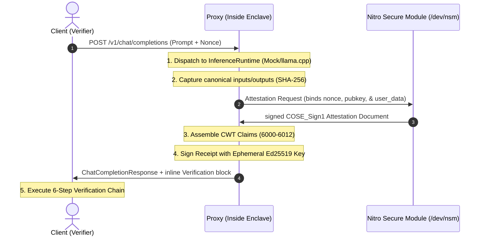

# VeriAI

[](https://www.rust-lang.org/)
[](LICENSE)
[](https://github.com/sssec81/veriai-sdk/actions)

VeriAI is a Rust workspace for creating and checking signed inference receipts. A receipt records hashes for the model, request, and response, and includes a hardware attestation document. The repository contains mock and AWS Nitro backends.

The SDK can only attest to the bytes it receives. In library mode, a caller could give it fabricated input or output while running a different model. A proxy inside the enclave is needed when the inference path itself must be covered by the attestation.

---

## Workspace Structure

The project is organized into a modular Cargo workspace isolating concerns:

```
crates/
├── veriai-types       # Shared CWT schemas, error definitions, and OpenAI API structures
├── veriai-core        # Merkle Tree hashing, receipt building, and verification engines
├── veriai-attestation # Hardware Attestation provider trait and mock/real driver backends
├── veriai-runtime     # InferenceRuntime traits and modular LLM adapters (mock/llama.cpp)
├── veriai-cli         # "veriai" CLI for inspecting and verifying receipts
└── verifier-service   # Axum REST service exposing JSON checklist verify endpoints

examples/
└── 01-chat-demo       # OpenAI-compatible completions server exporting verified receipts inline
```

---

## Architecture Flow



---

## Local demo

The default demo uses the mock attestation provider, so it runs on a normal workstation:

### 1. Run local E2E simulation script
```bash
# Execute local mock hardware pipeline
chmod +x demo.sh
./demo.sh
```

### 2. Start the OpenAI Chat Completions Server
```bash
# Launch completions endpoint
cargo run -p chat-demo
```
Send a chat request matching standard OpenAI completions signatures:
```bash
curl -X POST http://localhost:3000/v1/chat/completions \
  -H "Content-Type: application/json" \
  -d '{
    "model": "veriai-llama",
    "messages": [{"role": "user", "content": "hello veriai"}]
  }'
```
The response contains the completion and an inline verification summary. In
local mode the model hash is the real SHA-256 Merkle root of the GGUF file,
while attestation is provided by the mock provider:
```json
{
  "id": "chatcmpl-veriai-1784049384",
  "object": "chat.completion",
  "created": 1784049384,
  "model": "tinyllamas",
  "choices": [
    {
      "index": 0,
      "message": {
        "role": "assistant",
        "content": "Generated by llama.cpp"
      },
      "finish_reason": "stop"
    }
  ],
  "usage": {
    "prompt_tokens": 18,
    "completion_tokens": 40,
    "total_tokens": 58
  },
  "verification": {
    "valid": true,
    "receipt": {
      "version": "1",
      "model_hash": "<sha256-merkle-root-of-model.gguf>",
      "input_hash": "<sha256-of-canonical-request>",
      "output_hash": "<sha256-of-exact-completion>",
      "sequence_num": 0,
      "timestamp": 1784049384
    },
    "checks": [
      { "name": "Receipt Format", "status": "passed", "details": null },
      { "name": "Claims Parsing", "status": "passed", "details": null },
      { "name": "Attestation Type", "status": "passed", "details": null },
      { "name": "Receipt Signature", "status": "passed", "details": null },
      { "name": "Attestation Signature & Chain", "status": "passed", "details": null },
      { "name": "Attestation Timestamp Skew", "status": "passed", "details": null },
      { "name": "Receipt Timestamp Skew", "status": "passed", "details": null },
      { "name": "Timestamp Alignment", "status": "passed", "details": null },
      { "name": "PCR0 Check", "status": "passed", "details": null },
      { "name": "Pubkey Binding", "status": "passed", "details": null },
      { "name": "REPORTDATA Binding", "status": "passed", "details": null },
      { "name": "Nonce Matching", "status": "passed", "details": null },
      { "name": "Model Hash", "status": "passed", "details": null },
      { "name": "Input Hash", "status": "passed", "details": null },
      { "name": "Output Hash", "status": "passed", "details": null }
    ],
    "attestation_provider": "nitro",
    "verified_hardware": true,
    "error": null
  }
}
```

The same handler is available at `/proxy/v1/chat/completions` for the local
proxy-mode example. The server owns the runtime call and receipt creation; the
caller does not provide model or output hashes. To bind a caller challenge into
the receipt, send a 32-byte nonce as 64 hexadecimal characters:

```bash
curl -s http://localhost:3000/proxy/v1/chat/completions \
  -H "Content-Type: application/json" \
  -H "X-VeriAI-Nonce: 1111111111111111111111111111111111111111111111111111111111111111" \
  -d '{
    "model": "veriai-llama",
    "messages": [{"role": "user", "content": "Say hello"}]
  }' | jq
```

This local endpoint demonstrates the proxy boundary and uses mock attestation
by default. It is not an AWS Nitro deployment; the enclave and PCR0 boundary
still need to be validated on AWS.

The chat demo is explicitly mock hardware by default. For a real inference
adapter, install a pinned `llama-cli` binary and run the demo with:

```bash
VERIAI_RUNTIME=llama_cpp \
VERIAI_MODEL_PATH=/models/model.gguf \
LLAMA_CLI_PATH=/usr/local/bin/llama-cli \
cargo run -p chat-demo
```

The real-hardware build additionally requires `TRUSTED_ROOT_CERT_PATH` and
`EXPECTED_PCR0`. The demo hashes the canonical serialized request, the actual
model file, and the exact completion returned by `llama-cli`.

For a local real-inference/mock-attestation run, copy `.env.example`, set the
model path, and load it in your shell before starting the demo.

## Verification API

The versioned verifier endpoint is `POST /v1/verify`; `/verify` remains as a
backwards-compatible alias. Its request contains `receipt`, `model_hash`,
`input_hash`, `output_hash`, and `nonce`. Trusted root and PCR configuration are
server-side only. Validation errors return a stable `{ "code", "error" }`
shape, and `/version` reports `api_version: "v1"`.

```bash
curl -s http://localhost:8080/version | jq
curl -s http://localhost:8080/v1/verify \
  -H "Content-Type: application/json" \
  -d '{
    "receipt": "<hex-or-base64-cose-receipt>",
    "model_hash": "<64-hex-characters>",
    "input_hash": "<64-hex-characters>",
    "output_hash": "<64-hex-characters>",
    "nonce": "<64-hex-characters>"
  }' | jq
```

---

## Build configurations

VeriAI uses compile-time guards to prevent accidentally deploying mock hardware simulations to live environments:

- `mock-hardware` (Default for dev/local testing): Uses simulated NSM API and signs certificates using a test PKI. **Compile-time blocked in release builds.**
- `real-hardware`: Configures the SDK to open `/dev/nsm` using the official `aws-nitro-enclaves-nsm-api` driver.

### Compiling for Production
To build the SDK for deployment inside an AWS Nitro Enclave:
```bash
cargo build --release --no-default-features --features real-hardware
```

---

## Verifier limits

The verifier applies size and time limits through `VerifierConfig`:

```rust
pub struct VerifierConfig {
    pub max_receipt_size: usize, // Default: 64 KB (rejects oversized CBOR buffers before parsing)
    pub max_clock_skew: i64,      // Default: 300s (rejects attestation time skews)
    pub max_receipt_age: i64,     // Default: 300s (rejects old/expired receipt replays)
}
```

The verifier service reads trust configuration at startup rather than accepting it
from clients. Set `TRUSTED_ROOT_CERT_PATH` (or `TRUSTED_ROOT_CERT_PEM`) and
`EXPECTED_PCR0` (96 hex characters). Set `STATEFUL_VERIFICATION=true` to keep
sequence state for the lifetime of the service process.

---

## Security notes

[security_review.md](security_review.md) lists known risks and current follow-up work. It covers:
- CBOR/COSE resource exhaustion protection.
- Algorithm agility & header downgrade prevention (EdDSA alg validation).
- Input concatenation ambiguity mitigations.
- Ephemeral private key lifecycle.

---

## License

This project is licensed under the Apache License 2.0. See the LICENSE file for details.
